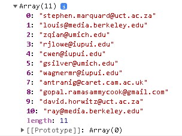

# Email Extractor

## Problem definition

You will be given a `Data` variable that contains some dummy data containing customers emails and some other things that we aren't interested in for now, so we want to extract all customers' emails from this data can u help us to achieve this goal?

- You have the data stored in `data` variable

```js
// js/data.js
const data = `From stephen.marquard@uct.ac.za Sat Jan  5 09:14:16 2008...`;
```

- To make the code more clean you will write the script in another file called `script.js` and you will have access to `data` variable

```js
// js/script.js

// here you have access to the data variable in data.js
// so you can do whatever you want with it
console.log(data.slice(0, 50));
```

## The results

As you saw previously you have data we need to extract emails from so you will write your code in `script.js` and when we open the browser console we should see the results `Array of unique (not repeated) emails` as u saw below



## How to achieve this goal?

- Display the data in the console to see how it looks like
- Try to see what is the common patterns between the emails like (does it always comes before the word `Hello`?)
- try to purify the emails from extra unneeded text
- now you have the array containing all emails (repeated)
- try to remove all repeated emails
- now it is finished :)
